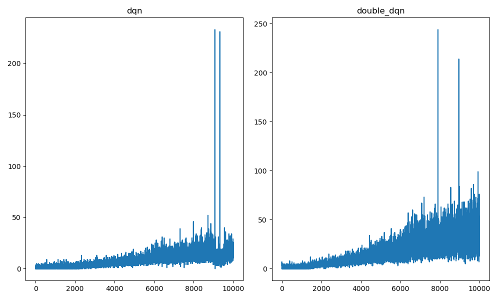

包含三个文件，其中运行的是Deep_Q_Network.py文件，下面是运行代码绘制的曲线图。 左边是dqn，右边是double_dqn，x轴表示迭代的epoch，y轴表示平均reward，可见两者在进行多次迭代的结果区别还是比较明显的。

dqn的对应视频和权重文件在同级目录内。double dqn的代码需要在dqn_agent内搜索todo注释进行修改。

<!-- <video id="video" controls="" preload="none" poster="封面">
      <source id="mp4" src="video.mp4" type="video/mp4">
</video> -->
